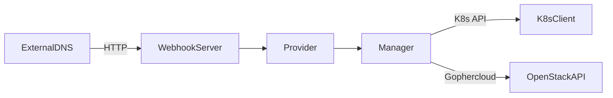

# Design Document

This document outlines the design and architecture of the ExternalDNS CERN Cloud Webhook Provider.

## Architecture

The application is structured as a standalone HTTP server that implements the [ExternalDNS Webhook Provider Interface](https://github.com/kubernetes-sigs/external-dns/blob/master/docs/tutorials/webhook-provider.md).

### Components

1.  **Server (`pkg/webhook`)**: Handles HTTP requests from ExternalDNS, routing them to the Provider.
2.  **Provider (`provider`)**: Implements the business logic interface (`Records`, `ApplyChanges`, `AdjustEndpoints`). It acts as the controller layer.
3.  **CERN Manager (`internal/cern`)**: The core domain logic. It orchestrates obtaining nodes from K8s and updating OpenStack.
4.  **K8s Client (`internal/k8s`)**: Interfaces with the Kubernetes API to identify ingress nodes.
5.  **Config (`pkg/config`)**: Centralized configuration management using `viper` and `pflag`.



## Domain Logic

### Ingress Node Discovery

The provider identifies target nodes by querying the **Kubernetes API** and mapping them to OpenStack Instances by name.

1.  **Label Selection**: It lists Kubernetes Nodes matching the configured `--ingress-label` (default: `node-role.kubernetes.io/ingress`).
2.  **Name Extraction**: It extracts the `Name` of these Kubernetes Nodes.
3.  **OpenStack Mapping**: It lists **all** active OpenStack instances and filters them to find those whose `Name` matches the Kubernetes Node names.
    *   *Note*: This approach is O(N) where N is the number of OpenStack instances, as the OpenStack API does not support efficient filtering by a list of names or getting ID from K8s labels/annotations reliably in this specific environment.

### Metadata Management (`landb-alias`)

CERN DNS integration relies on the `landb-alias` metadata property on OpenStack instances.

**Format Rules:**
*   **Suffix**: All records must end in `--load-N-`, where `N` represents the alias order (effectively the index of the node in the sorted list of ingress nodes).
    *   Node 0 gets: `<alias>--load-0-`
    *   Node 1 gets: `<alias>--load-1-`
*   **Multiple Aliases**: Multiple aliases on the same node are comma-separated.
    *   Example: `alias1.cern.ch--load-0-,alias2.cern.ch--load-0-`

**Constraint Handling (254 Characters):**
OpenStack metadata values are limited to 254 characters. The provider handles this by splitting the list of aliases across multiple keys:
*   `landb-alias`
*   `landb-alias2`
*   `landb-alias3`
*   ...and so on.

The `GenerateMetadata` function in `internal/cern/metadata.go` implements the logic to pack aliases into these keys efficiently.

### Synchronization Flow

1.  **Retrieve State (`Records`)**:
    *   Query K8s for Ingress Node Names.
    *   Scan OpenStack for matching Instances.
    *   Parse `landb-alias*` metadata keys to reconstruct the current list of DNS endpoints.
    *   Endpoints are returned to ExternalDNS.

2.  **Apply Changes (`ApplyChanges`)**:
    *   ExternalDNS sends a `Plan` with `Create`, `Update`, and `Delete` lists.
    *   The provider calculates the **desired state** for all ingress nodes based on the final list of endpoints.
    *   **Deterministic Assignment**: Endpoints are assigned to nodes based on the sorted order of nodes. This ensures that `aliasA` always maps to `Node 0` as `aliasA--load-0-`, minimizing metadata churn if other nodes change.
    *   **Diff & Update**: The provider compares the current metadata of each node with the calculated desired metadata.
    *   **Atomic Updates**: `UpdateMetadata` is called only for nodes that require changes. The update is performed per-node.

## Data Flow Diagram

```
[ExternalDNS]
      |
      | POST /records (Changes)
      v
[Provider]
      |
      | 1. Get Ingress Node Names (List K8s Nodes)
      v
[CERN Manager]
      |
      | 2. List All OpenStack Instances
      | 3. Match K8s Names to OpenStack Names
      | 4. Calculate Desired Metadata (for each matched node)
      |    Input: [Endpoint A, Endpoint B], Nodes [0, 1]
      |    Node 0: landb-alias="A--load-0-,B--load-0-"
      |    Node 1: landb-alias="A--load-1-,B--load-1-"
      |
      | 5. Diff with Current Metadata
      v
[OpenStack API]
      |
      | 6. Update/Delete Metadata keys
      v
[Infrastructure]
```

## Considerations

*   **Performance**: Listing all OpenStack instances can be slow in very large environments.
*   **Concurrency**: The current implementation processes nodes sequentially during the update phase.
*   **Error Handling**: Errors during the update phase are reported to ExternalDNS, which will trigger a retry.
*   **Dry Run**: The `--dry-run` flag allows simulating changes without affecting the infrastructure.
